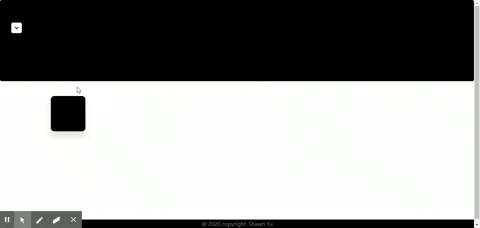
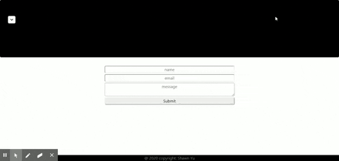

# React-Portfolio-Page

https://mernportfolioshawnyu.herokuapp.com

I created my portfolio page wanting to give the user a sense of discovery .
most of the content is hidden until the user clicks on certain objects .

